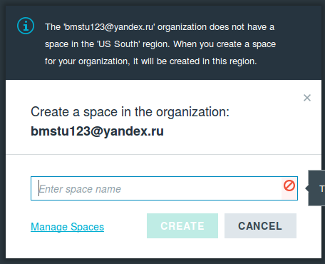
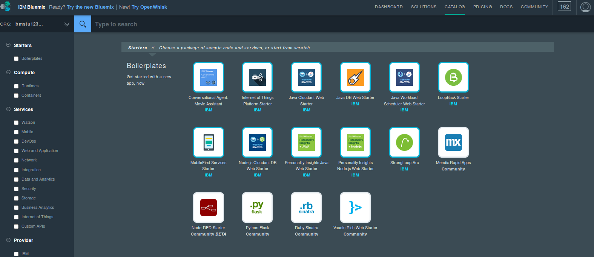
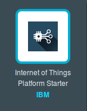
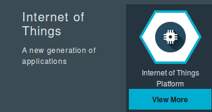
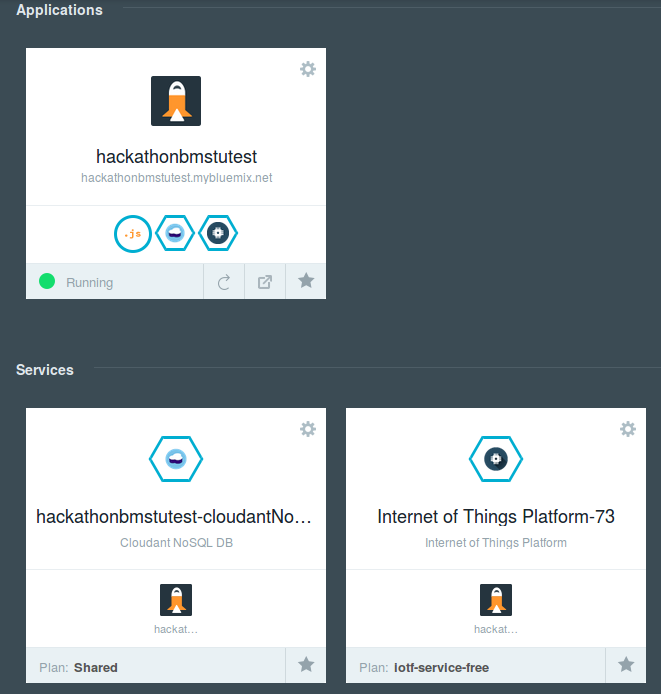
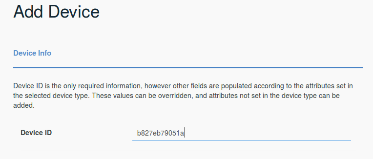
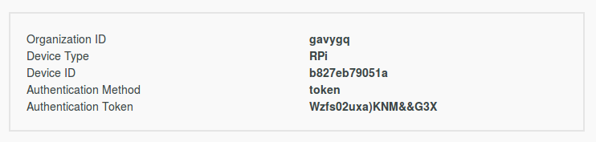

## Raspberry Pi <a name="29"></a>
Данный раздел посвящён коммуникации с Arduino и Bluemix со стороны Raspberry Pi, для чего мы напишем скрипт на python. К сожалению, придётся использовать python 2 из-за библиотеки `pi_switch`.


### Получение данных с Arduino <a name="30"></a>
Для начала необходимо получить данные по радиоканалу. Вспомним формат передаваемых данных:
```
+----------+-----------+---------+
| group id | sensor id |  data   |
|  8 bits  |   8 bits  | 16 bits |
+----------+-----------+---------+
|<----------- 32 bits ---------->|
```

Для работы с радиоканалом нам потребуется использовать библиотеку `pi_switch`:
```python
from pi_switch import RCSwitchReceiver

receiver = RCSwitchReceiver()
receiver.enableReceive(2)
  ```

Так как нас интересует далеко не вся информация, необходимо перед декодированием пакета проверять номер группы:
```python
def check_group(packet):
    return (packet >> 24) == GROUP_ID
```

Так же нам потребуется функция для декодирования пакета, т.е. извлечения идентификатора датчика и данных с этого датчика. Данные с датчика хранятся в дополнительном коде, что необходимо учесть:
```python
def decode(packet):
    sid = (packet >> 16) & 0xff
    data = packet & 0xffff

    # Преобразование отрицательного значения.
    if data & 0x8000:
        data = data - 0x10000
    return sid, data
```

Взаимодействие с библиотекой происходит в неблокирующем стиле: данные накапливаются во внутреннем буфере, пока пакет не будет полностью получен, после чего данные могут быть обработаны:
```python
def receive_if_available():
    # Проверка наличия данных в буфере.
    if not receiver.available():
        return

    # Получение данных и сброс буфера.
    packet = receiver.getReceivedValue()
    receiver.resetAvailable()

    # Наш ли это пакет.
    if packet and check_group(packet):
        return decode(packet)
```


###Создание приложения в *Bluemix* <a name="31"></a>

Перейти по ссылке: https://bluemix.net/. Введите Ваш логин и пароль. Перейдите в раздел DASHBOARD. При необходимости создайте новую организацию (например, `dev`).


Перейдите в раздел CATALOG.


**Рабочее поле Bluemix.**

Добавьте в проект компонент Internet of Things Foundation Starter. 
В результате буду добавлены приложение SDK for Node.js  и сервисы Cloudant NoSQL DB и IoT Foundation.


После этого добавьте в проект сервис IoT Foundation. 
При создании в поле App укажите имя вашего приложения IoT Foundation Starter, что позволит автоматически связать SDK for Node.js с брокером MQTT.


Сервис IoT Foudation является интегрированным компонентом на основе брокера MQTT запросов. 
Для его использования необходимо выполнить конфигурацию брокера на прием пакетов от RaspberriPi.
Создадим описание нового устройства.
В результате ваш проект будет иметь следующий вид.


**Рабочее поле Bluemix после довбавление IoT Foundation и IoT Foundation Starter.**

Перейдите в раздел DASHBOARD. Запустите конфигурирование сервиса IoT Foundation (Launch dashboard).
Далее добавьте новое устройство (Add Device). 
Создайте новый тип устройства (например, с именем: RPi). Все поля за исключением поля Name можно оставить пустыми.

Для добавления устройства созданного Вами типа понадобится определить уникальный DeviceID устройства (например, его mac адрес).



В следующем окне Вы можете выбрать один из двух вариантов: использовать автоматически сгенерированный токен или добавить существующий токен устройства. Выберем первый вариант (оставьте поле token пустым). В результате Вам будет выдана информация о настройках устройства, которые необходимо сохранить для последующего использования (см. следующее задание).




Полезной функцией IoT Foundation консоли является возможность просмотра логов сообщений MQTT. Данная возможность может быть использована для проверки работоспособности всей инфраструктуры, поиска ошибок и пр. 


### Отправка данных в *Bluemix* <a name="32"></a>
Для связи с Bluemix логично использовать протоколы, основанные на TCP или UDP. В данном примере используется MQTT.

После регистрации устройства в Bluemix мы получаем данные для авторизации, которые поместим в файл [device.cfg](src/device.cfg):
```ini
[device]
org=md8qpm
type=bmstu001
id=b827eb79051a
auth-method=token
auth-token=3BZu_drqRuAKH*K*+i
```

Bluemix предоставляет библиотеку ibmotf — небольшую обёртку над MQTT, инициализация соединения с которой выглядит как:
```python
import ibmiotf.device

def connect(config):
    options = ibmiotf.device.ParseConfigFile(config)
    client = ibmiotf.device.Client(options)
    client.connect()
    return client

client = connect('device.cfg')
```

После открытия соединения можно передавать данные, публикуя события:
```python
sid_to_topic = ['temperature', 'angle']

def send_data(sid, data):
    topic = sid_to_topic[sid]
    client.publishEvent(topic, 'json', data)
```

Теперь мы можем отправлять данные в облако по MQTT, получаемые с arduino по 433MHz-радиоканалу:
```python
def main():
    while True:
        payload = receive_if_available()
        if payload:
            sid, data = payload
            if 0 <= sid <= 1:
                send_data(sid, data)
            else:
                time.sleep(0.1)
```

Стоит заметить, что ждать необходимо только в отсутствии данных. Действительно, если ждать при любом исходе, то это может привести к накапливанию в буфере ненужных пакетов (полученных по ошибке) или в результате задержки на самой arduino.

### Получение данных из *Bluemix* <a name="33"></a>

В нашем случае нажатие на кнопку в веб-интерфейсе приведёт к гудку через динамик, подключённый к raspberry. Для работы с ним воспользуемся библиотекой `RPIO`.

Сконфигурируем GPIO-порт:
```python
import RPIO

BUZZER = 22
RPIO.setup(BUZZER, RPIO.OUT, initial=RPIO.LOW)
```

Теперь необходимо подписаться на получение данных из Bluemix:
```python
def connect(config):
    # ...
    client.commandCallback = on_message
    return client

def on_message(cmd):
    if cmd.command != 'button':
        return

    RPIO.output(BUZZER, 1)
    time.sleep(.05)
    RPIO.output(BUZZER, 0)

    print cmd
```

При инициализации соединения библиотека создаёт отдельный поток, в котором ожидаются поступающие события, называемые командами. После получения команды вызывается наш обработчик.

Полный код доступен [здесь](src/raspberry.py).
