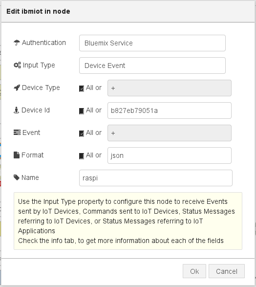
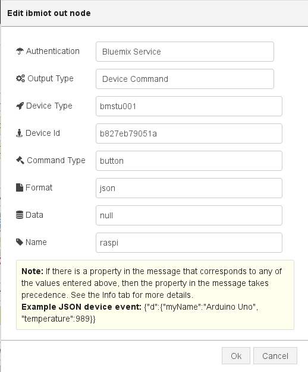
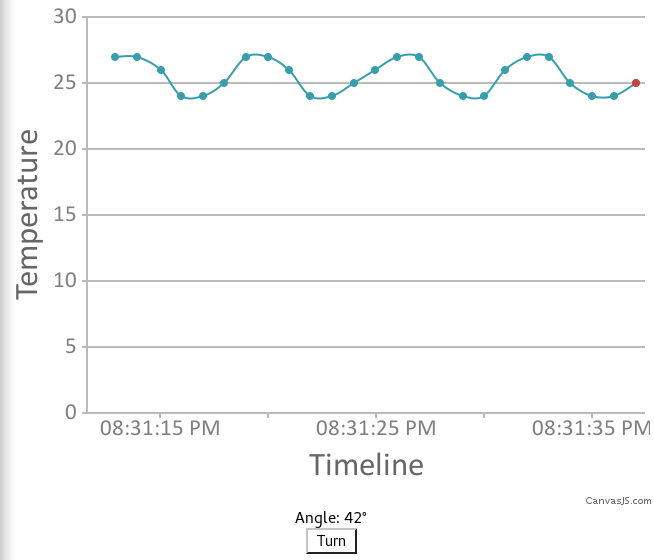

## Визуализация <a name="34"></a>
### Сервер <a name="35"></a>

Из рабочего пространства проекта перейдите в приложение SDK for NODE.js. В левом верхнем углу нажмите на ссылку для перехода в SDK NodeRED.
Дальнейшие действия поясняют процесс создания приложений в данном SDK.

Точкой входа в веб-приложение является файл `index.html`, для получения которого браузер выполняет http-запрос к нашему серверу. Поэтому нам необходимо воспользоваться node-red узлами `input/http` и `output/http`:


**Статический сервер.**

Теперь вход в приложение может быть осуществлён по адресу http://YOU_PROJECT_NAME.eu-gb.mybluemix.net/index.html (например, [http://example-hack.eu-gb.mybluemix.net/index.html](http://example-hack.eu-gb.mybluemix.net/index.html)).

Содержимое `index.html` и `index.js` подробно рассматривается в следующем разделе. Полный код: [index.html](src/index.html) и [index.js](src/index.js). Полный исходник всех потоков доступен [здесь](src/flows.json).

Теперь нам необходимо настроить взаимодействие с raspberry, т.е. получение и отправку данных. Для этого используется node-red узлы `input/ibmiot` и `output/ibmiot`:


**Настройки узла `input/ibmiot`.**


**Настройки узла `output/ibmiot`.**

Теперь мы можем взаимодействовать с raspberry:


**Получение и отправка данных.**

Узел трансформации `transform` просто преобразует данные для пересылки клиенту:
```javascript
msg.payload = {
    TIME: Date.now(),
    TEMP: msg.payload
};

return msg;
```

### Клиент <a name="36"></a>
В данном разделе рассмотрим вопрос реализацию визуализации на клиенте.


**Визуализация потоковых данных.**

В ответ на запрос `index.html`, сервер отдаёт страницу, в которой содержатся:

1. Ссылка на библиотеку для рисования графиков:
  ```html
  <script src="//cdnjs.cloudflare.com/ajax/libs/canvasjs/1.7.0/canvasjs.min.js"></script>
  ```
2. Ссылка на наш код, получающий данные:
  ```html
  <script src="index.js" defer></script>
  ```
3. Некоторые элементы, используемые в скрипте:
  ```html
  <div id="graph"></div>
  <div>Angle: <span id="angle">??</span>°</div>
  <input type="button" id="turn-btn" value="Turn on">
  ```

Рассмотрим подробнее логику клиента.

Для начала необходимо получить данные с bluemix. Для этого мы открываем сокет:
```javascript
var socket = new WebSocket('ws://' + window.location.host + '/data');
```

Теперь нам потребуется обработчик поступающих данных:
```javascript
socket.onmessage = function(e) {
  var item = JSON.parse(e.data);

  switch (item.topic) {
    case 'temperature':
      processTemp(item.data);
      break;
    case 'angle':
      processAngle(item.data);
      break;
  }
};
```

#### График температуры <a name="37"></a>
После получения актуальной температуры необходимо отобразить новое значение на графике:
```javascript
var $graph = document.querySelector('#graph');

// Массив, содержащий все точки.
var actual = [{x: new Date}];

var chart = new CanvasJS.Chart($graph, {
  axisX: {title: "Timeline"},
  axisY: {title: "Temperature"},
  data: [{
    type: "spline",
    dataPoints: actual
  }]
});

chart.render();

function processTemp(temp) {
  var now = new Date;

  // Будем хранить только последние две минуты.
  if (+now - actual[0].x > 2 * 60 * 1000)
    actual.shift();

  var point = {x: now, y: temp};
  actual.push(point);
  chart.render();
}
```

#### Угол поворота <a name="38"></a>
После получения актуального значения угла достаточно просто обновить элемент:
```javascript
var $angle = document.querySelector('#angle');

function processAngle(angle) {
  $angle.innerHTML = angle;
}
```

#### Кнопка <a name="39"></a>
При нажатии на кнопку нам важен сам факт нажатия, поэтому достаточно посылать `true`:
```javascript
var $button = document.querySelector('#turn-btn');
$button.onclick = function() {
  socket.send(true);
};
```
