##Аналитическая обработка данных

В этой части проекта необходимо выполнить статистическую обработу получяемых данных. Для реализации этого потребуется реализровать следующие компоненты инфраструктуры:
- В платформе Bluemix реализовать сервис хранения данных в БД dashDB. 
- Разработать структуру таблиц базы данных и SQL скрипты для добавления новых данных и удаления устаревших данных.
- Разработать поток Node-Red, реализующий запуск SQL скриптов. 
- Выполнить проверку работоспособности потока с использованием консоли административной косноли dashDB.
- Выполнить разработку аналитического скрипта на языке R в среде RStudio.
- Разработать потока обработки Node-Red для запуска R скрипта.	

Дополнительная информация: 

[Язык программирования R](https://ru.wikibooks.org/wiki/%D0%AF%D0%B7%D1%8B%D0%BA_%D0%BF%D1%80%D0%BE%D0%B3%D1%80%D0%B0%D0%BC%D0%BC%D0%B8%D1%80%D0%BE%D0%B2%D0%B0%D0%BD%D0%B8%D1%8F_R)

[Краткая справка по командам языка R](https://cran.r-project.org/doc/contrib/Short-refcard.pdf)

[Описание IDE RStudio](http://r-analytics.blogspot.ru/p/rstudio.html#.VuiE7x_fVNA)

[Инструкции определения данных на языке DDL](https://msdn.microsoft.com/ru-ru/library/cc879262%28v=sql.120%29.aspx)

[Краткий справочник по командам SQL](http://4its.ru/html/sql-commands.html)


###Работа с сервисом dashDB

К началу этапа рабочая область проекта представляет собой три взаимосвязанных компонента:
- Сервис IoT Foundation для реализации функций брокера MQTT
- Сервис CloudantDB для хранения настроек  IoT Foundation и Node-Red.
- Приложения JavaScript в Node-Red сервере приложений.

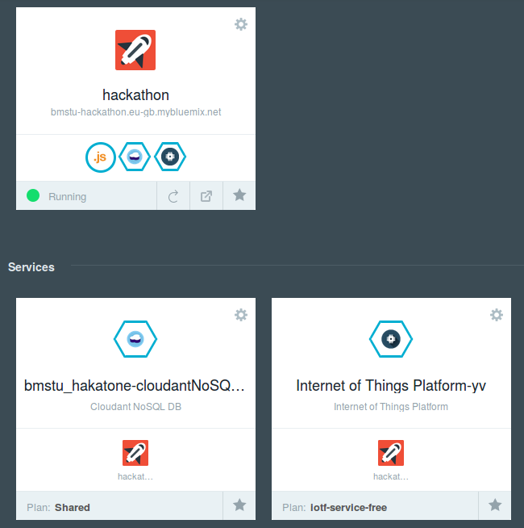

Сервис dashDB представляет собой интегрированные компоненты для реализации функций хранения и аналитической обработки данных с помощью языка R. Сервис позволяет создавать и контролировать состояние SQL базы данных dashDB, содержит набор готовых скриптов на языке R, позволяет создавать и отлаживать пользовательские скрипты.

####Добавление сервиса в проект
Выполним добавление сервиса dashDB. 
На вкладке Catalog в секции Data and Analythics необходимо выбрать сервис dashDB.

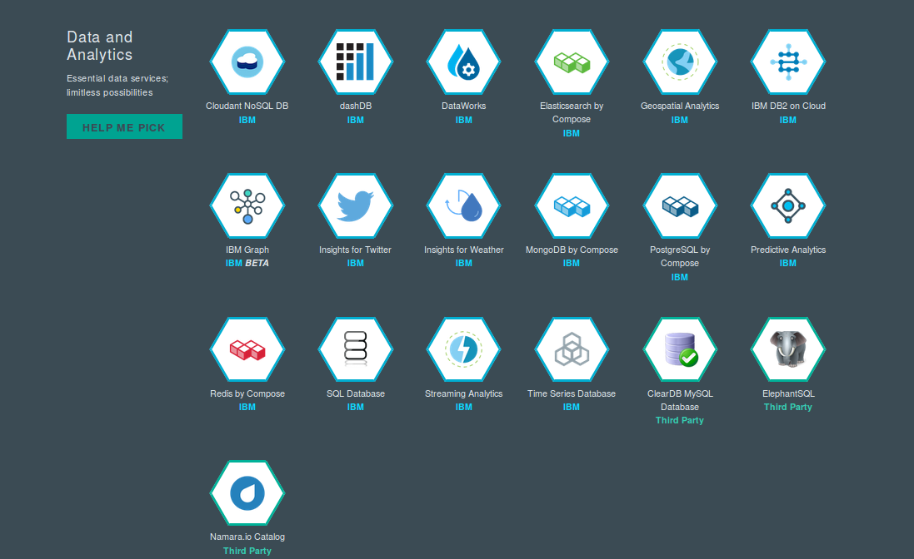

В следующем окне вводятся поля Dev, App, Service. Все поля кроме App можно оставить без изменений. В поле App в выпадающем списке выберете имя вашего приложения Node-Red. Cвязывание позволит выполнять обращения к dashDB со стороны приложений Node-Red (можно выполнить связывание позднее).

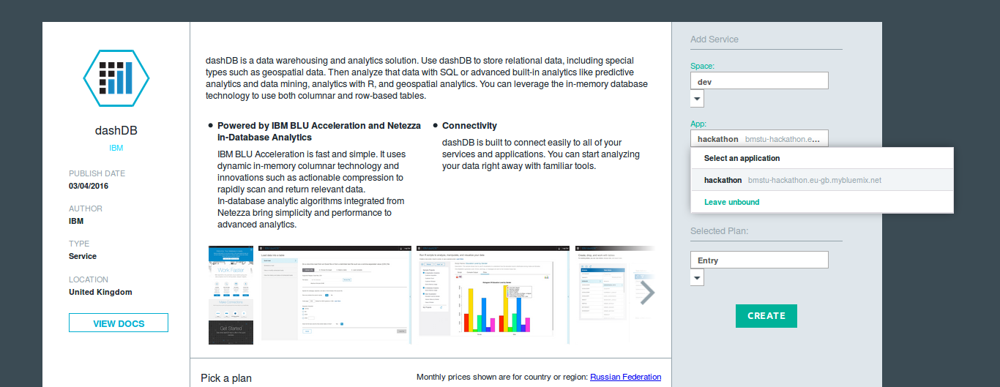

Нажмите кнопку Create. После создания сервиса появится возможность перейти в консоль управления. Для этого нажмите на кнопку Launch.

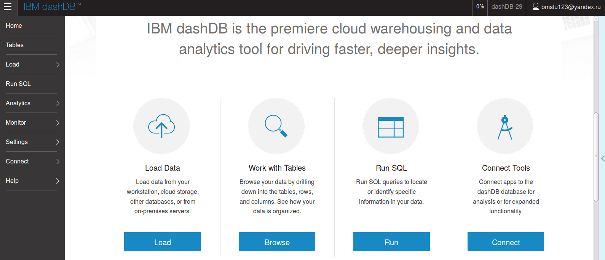

Для работы с сервисом необходимо определить параметры: 

* ***User ID***,
 
* ***Host name***, 

* ***Password***. 

Указанная информация доступна на владке Connect в пункте Connect Information. Указанная информация понадобится впоследствии. 

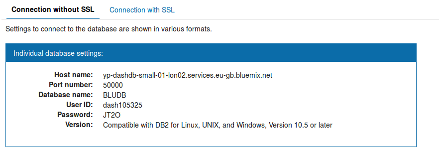


####Создание таблиц

На вкладке Tables объединены функции управления структурой базы данных. При создании сервиса автоматически создается новая база с именем, совпадающим в полем User ID (в примере: DASH105325).

Добавим в базу следующие таблицв таблицы:

- Таблицы ANGLE и TEMP для хранения первичных данных от датчиков угла и температуры.
- Таблицы PANGLE и PTEMP для хранения предиктивных данных  для угла и температуры.

Для этого необходимо выбрать пункт Add Table и в открывшемся окне ввести код DDL.

```SQL
CREATE TABLE "TEMP" 
(
  "ID" INTEGER NOT NULL GENERATED ALWAYS AS IDENTITY (START WITH 1, INCREMENT BY 1, NO CACHE ),
  "TEMP" DOUBLE,
  "TS" TIMESTAMP,
  PRIMARY KEY(ID)
);
```


```SQL
CREATE TABLE "ANGLE" 
(
  "ID" INTEGER NOT NULL GENERATED ALWAYS AS IDENTITY (START WITH 1, INCREMENT BY 1, NO CACHE ),
  "ANGLE" DOUBLE,
  "TS" TIMESTAMP,
  PRIMARY KEY(ID)
);
```

```SQL
CREATE TABLE "PTEMP" 
(
  "ID" INTEGER NOT NULL GENERATED ALWAYS AS IDENTITY (START WITH 1, INCREMENT BY 1, NO CACHE ),
  "PTEMP" DOUBLE,
  "TS" TIMESTAMP,
  PRIMARY KEY(ID)
);
```


```SQL
CREATE TABLE "PANGLE" 
(
  "ID" INTEGER NOT NULL GENERATED ALWAYS AS IDENTITY (START WITH 1, INCREMENT BY 1, NO CACHE ),
  "PANGLE" DOUBLE,
  "TS" TIMESTAMP,
  PRIMARY KEY(ID)
);
```

Поле TS во всех таблицах предусмотрено для хранения метки времени. Ключевое поле ID содержит автоинкрементное значение номера записи (данное поле необходимо для отсчета значений в скриптах R и построения графиков). 

####Запуск потоковой записи первичных данных.

В приложении Node-Red необходимо связать блок IoT Foundation с функциональными блоким, формирующими структуру объекта payload, после чего прередать его в блок "dashDB out node". В блоке dashDB указать поле Service dashDB-xx (название сервиса dashDB).


!!!!!!!!!!обновить
```json
[{"id":"7562821a.8a9d7c","type":"ibmiot in","z":"464be866.b9b418","authentication":"quickstart","apiKey":"","inputType":"evt","deviceId":"93d7da18e689","applicationId":"","deviceType":"+","eventType":"+","commandType":"","format":"json","name":"IBM IoT App In","service":"quickstart","allDevices":false,"allApplications":false,"allDeviceTypes":true,"allEvents":true,"allCommands":false,"allFormats":false,"x":184,"y":320,"wires":[["410e7525.bef18c","522c279c.add3d8"]]},{"id":"410e7525.bef18c","type":"function","z":"464be866.b9b418","name":"iot_db","func":"var interval = (1000*5); // minimum interval between messages (ms)\ncontext.lastTime = context.lastTime || 0;\n\nvar now = Date.now();\n\nif (now-context.lastTime < interval) {\n  return null;\n} \nelse\n{\n    context.lastTime = now;\n    msg.payload =\n    {\n        TS : 'TIMESTAMP',\n        TEMP : msg.payload.d.temp,\n        ANGLE : msg.payload.d.angle\n    }\n    return msg;\n}\n","outputs":1,"noerr":0,"x":478,"y":256.5,"wires":[["46a5a421.b95a5c"]]},{"id":"46a5a421.b95a5c","type":"dashDB out","z":"464be866.b9b418","service":"dashDB-nx","table":"SOURCE","name":"SAVE SOURCE","x":714,"y":256,"wires":[]},{"id":"522c279c.add3d8","type":"function","z":"464be866.b9b418","name":"iot_db","func":"var interval = (1000*5); // minimum interval between messages (ms)\ncontext.lastTime = context.lastTime || 0;\n\nvar now = Date.now();\n\nif (now-context.lastTime < interval) {\n  return null;\n} \nelse\n{\n    context.lastTime = now;\n    msg.payload =\n    {\n        TS : 'TIMESTAMP',\n        TEMP : msg.payload.d.temp,\n        ANGLE : msg.payload.d.angle,\n        PREDICTTEMP : null,\n        PREDICTANGLE : null\n    }\n    return msg;\n}\n","outputs":1,"noerr":0,"x":474,"y":399,"wires":[["1b11131.fe4eeed"]]},{"id":"1b11131.fe4eeed","type":"dashDB out","z":"464be866.b9b418","service":"dashDB-nx","table":"MIXED","name":"SAVE MIXED","x":711,"y":399,"wires":[]},{"id":"250de2a4.daf21e","type":"comment","z":"464be866.b9b418","name":"Добавление данных в таблицу SOURCE","info":"Добавление данных в таблицу SOURCE","x":609,"y":221,"wires":[]},{"id":"b62334a4.49dcc8","type":"comment","z":"464be866.b9b418","name":"Добавление данных в таблицу MIXED","info":"Добавление данных в таблицу MIXED","x":603,"y":358,"wires":[]}]
```

*Примечание: для вставки кода потока в Node-Red в правом вурхнем углу выберите пункт Import и далее пункт Clipboard. Скопируйте код в открывшееся окно и нажмите OK.*


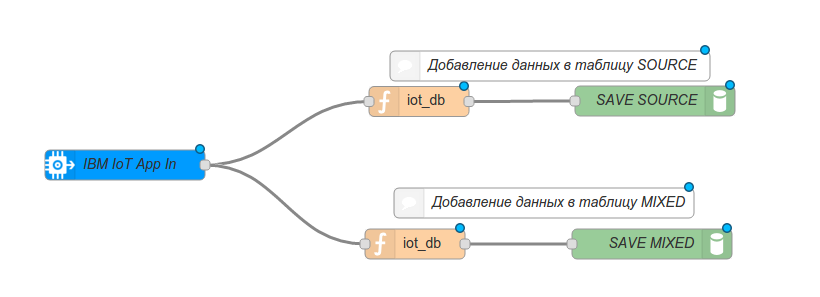


Обратите внимание, что в функциональных блоках название ключей в структуре payload должно совпадать с полями таблицы базы данных.

Например:

```js
    msg.payload =
    {
        ts : 'TIMESTAMP',
        temp : msg.payload.d.temp
    }
    return msg; 
```

Проверим работоспособность приложения (кнопка Deploy). В консоли управления dashDB на вкладе Tables выберете таблицу SOURCE и Browse Data.
Данные от сенсоров должны быть выбаны на экран. 

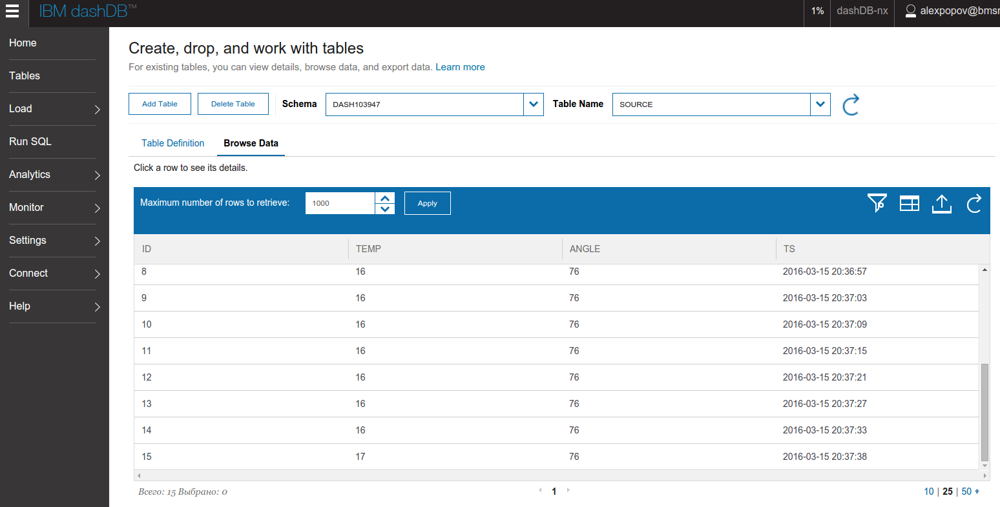


####Удаление данных из таблиц

Все полученные данные накапливаются в таблицах SOURCE,ANALYTHIC и MIXED. Так как время аналитической обработки зависит от объемов данных, выпролним удаление устаревших строк из таблиц. Для этого добавим следующий поток обработки, содержащий SQL скрипты


!!!!!!!!!!!!!Обновить
```json
[{"id":"ed3191e1.12ce7","type":"inject","z":"464be866.b9b418","name":"Clear table","topic":"","payload":"","payloadType":"date","repeat":"30","crontab":"","once":true,"x":319,"y":629,"wires":[["3a10c273.c5ef3e","c2da84ed.3d2578","fc00c702.03ff38"]]},{"id":"3a10c273.c5ef3e","type":"dashDB in","z":"464be866.b9b418","service":"dashDB-nx","query":"DELETE FROM SOURCE WHERE ID<=(SELECT max(ID) FROM SOURCE)-200;","params":"","name":"DLELETE OLD from SOURCE","x":607,"y":572.5,"wires":[[]]},{"id":"eb53b616.14ac48","type":"comment","z":"464be866.b9b418","name":"Удаление старых данных","info":"Удаление старых данных","x":526,"y":526,"wires":[]},{"id":"c2da84ed.3d2578","type":"dashDB in","z":"464be866.b9b418","service":"dashDB-nx","query":"DELETE FROM ANALYTHIC WHERE ID<=(SELECT max(ID) FROM ANALYTHIC)-200;","params":"","name":"DLELETE OLD from ANALYTHIC","x":614,"y":642,"wires":[[]]},{"id":"fc00c702.03ff38","type":"dashDB in","z":"464be866.b9b418","service":"dashDB-nx","query":"DELETE FROM MIXED WHERE ID<=(SELECT max(ID) FROM MIXED)-200;","params":"","name":"DLELETE OLD from MIXED","x":597,"y":710,"wires":[[]]}]
```

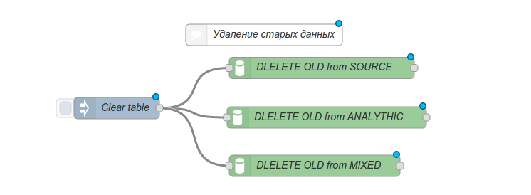


####Создание скрипта в Rstudio

В консоли dashDB перейти в пунтк Analythics и далее R Scripts. 
Выбрать пункт RStudio. 

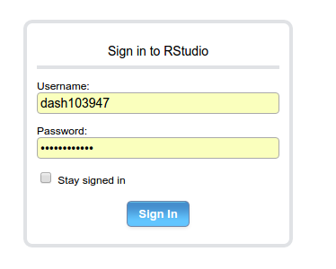

В результате будет открыто окно RStudio, в котором может выполняться пошаговая отладка команд на языке R.

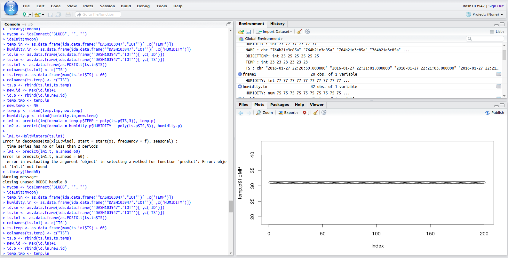

Подробнее о работе с IDE RStudio можно узнать [тут](http://r-analytics.blogspot.ru/p/rstudio.html#.VuiE7x_fVNA)

Выполним следующий скрипт (скрипт может быть вставлен в окно Console):

```R
#подключение к dashDB
library(ibmdbR) 
mycon <- idaConnect("BLUDB", "", "") 
idaInit(mycon) 
#портирование таблицы TEMP во фреймы
temp.in <- as.data.frame(ida.data.frame('"DASH??????"."TEMP"')[ ,c('TEMP')]) 
id.in <- as.data.frame(ida.data.frame('"DASH??????"."TEMP"')[ ,c('ID')]) 
ts.in <- as.data.frame(ida.data.frame('"DASH??????"."TEMP"')[ ,c('TS')])
#Преобразование timestamp в POSIX формат
ts.in1 <- as.data.frame(as.POSIXlt(ts.in$TS))
colnames(ts.in1) <- c("TS")
#Определяем интервал для предиктивного анализа
ts.temp <- as.data.frame(max(ts.in1$TS) + 60)
colnames(ts.temp) <- c("TS")
ts.p <- rbind(ts.in1,ts.temp)
#добавление id для задания предиктивных точек
new.id <- max(id.in)+1
id.p <- rbind(id.in,new.id)
#для искомой переменной устанавливаем значение неопределенности NA
temp.tmp <- temp.in
new.temp <- NA
temp.p <- rbind(temp.tmp,new.temp)
#выполняем регрессионный анализ для датчика температуры
lm1 <- predict(lm(formula = temp.p$TEMP ~ ts.p$TS), temp.p)
lm1.temp<-lm1[length(lm1)]
query <- idaQuery("INSERT INTO PTEMP (\"TS\",\"PTEMP\")  VALUES (TIMESTAMP('",ts.temp$TS[1],"',10),",lm1.temp,")")
#портирование таблицы ANGLE во фреймы
angle.in <- as.data.frame(ida.data.frame('"DASH??????"."ANGLE"')[ ,c('ANGLE')]) 
id.in <- as.data.frame(ida.data.frame('"DASH??????"."ANGLE"')[ ,c('ID')]) 
ts.in <- as.data.frame(ida.data.frame('"DASH??????"."ANGLE"')[ ,c('TS')])
#Преобразование timestamp в POSIX формат
ts.in1 <- as.data.frame(as.POSIXlt(ts.in$TS))
colnames(ts.in1) <- c("TS")
#Определяем интервал для предиктивного анализа
ts.temp <- as.data.frame(max(ts.in1$TS) + 60)
colnames(ts.temp) <- c("TS")
ts.p <- rbind(ts.in1,ts.temp)
#добавление id для задания предиктивных точек
new.id <- max(id.in)+1
id.p <- rbind(id.in,new.id)
#для искомой переменной устанавливаем значение неопределенности NA
angle.tmp <- angle.in
new.temp <- NA
angle.p <- rbind(angle.tmp,new.temp)
#выполняем регрессионный анализ для датчика температуры
lm1 <- predict(lm(formula = angle.p$angle ~ ts.p$TS), angle.p)
lm1.temp<-lm1[length(lm1)]
query <- idaQuery("INSERT INTO PANGLE (\"TS\",\"PANGLE\")  VALUES (TIMESTAMP('",ts.temp$TS[1],"',10),",lm1.temp,")")
```

В указанном скрипте поле DASH?????? заменить на поле User ID (имя пользователя dashDB). Нажать Enter. 
В результате скрипт будет выполнен, все использованные фреймы могут быть проанализированы на вкладке Environment.

####Запись скрипта в файловую систему окружения dashDB.

Для автоматического запуска разработанного скрипта необходимо сохранить его в рабочем пространстве проекта. Для этого необходимо перейти в косоль управления dashDB в пункт Analythics и пункт RScripts. Далее необходимо создать новый скрипт (+) и выполнить вставку кода R. Сохраним скрипт под именем predict.R .


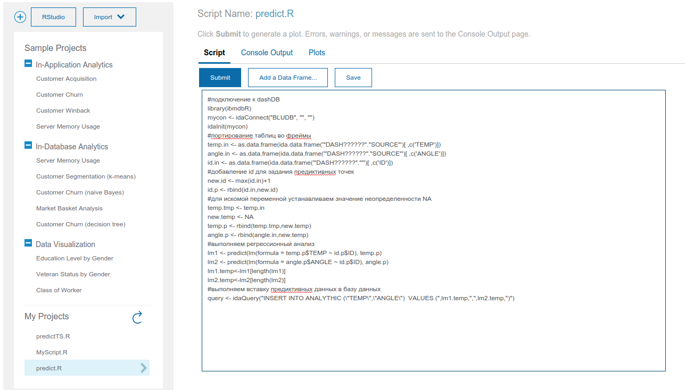

Также можно выполнить тестовый запуск скрипта, нажав на кнопку Submit. В результате в таблицах PANGLE и PTEMP будут сохранены предиктивные данные.


###Запуск скрипта по расписанию из NodeRED


В редакторе NodeRed создайте следующий поток:


```json
[{"id":"182e4cef.741a2b","type":"http response","z":"8d8674d5.c5d9a","name":"console","x":803,"y":917,"wires":[]},{"id":"240800e2.938a88","type":"function","z":"8d8674d5.c5d9a","name":"","func":"msg.payload = \"cmd=RScriptRunScript&command=source(%22~/predict.R%22)&fileName=&profileName=BLUDB&userid=dash??????\";\nmsg.headers = {\"content-type\": \"application/x-www-form-urlencoded\"};\nreturn msg;","outputs":1,"noerr":0,"x":370,"y":916,"wires":[["83dbda70.6916f8"]]},{"id":"83dbda70.6916f8","type":"http request","z":"8d8674d5.c5d9a","name":"R Script","method":"POST","ret":"txt","url":"https://XXXXXXXXXXXXXXXX:8443/console/blushiftservices/BluShiftHttp.do","x":580,"y":916,"wires":[["182e4cef.741a2b"]]},{"id":"f4590f4f.941a68","type":"inject","z":"8d8674d5.c5d9a","name":"","topic":"","payload":"","payloadType":"date","repeat":"60","crontab":"","once":false,"x":163,"y":915.5,"wires":[["240800e2.938a88"]]}]

```


В данном коде необходимо заменить следующие поля:

- dash?????? — User ID пользователя dashDB (например DASH015794)
- XXXXXXXXXXXXXX — Host name адрес dashDB приложения (например awh-yp-small03.services.dal.bluemix.net).

В блоке RScript необходимо выбрать способ аутентификации ([v] Use basic authentication?), в полях Username и Password указать значения user ID и password из настроек dashDB. Интервал запуск задается в блоке Timestamp. Для этого в поле Repeat нужно указать временной интервал между генерацией сообщений (например, 20 секунд).


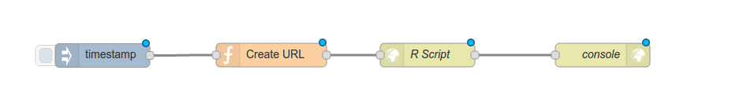


